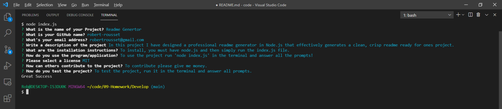

# Professional README Generator

## My Task

In this project I have successfuly generated a professional readme file through the termical using node.js. This readme is generated by using the inquirer module and the file system core node module. 

To complete this task I had to invoke inquirer's prompt function, which asked a series of questions that I had written. After all questions are answered, a promise is met and the .then(function) is called which invokes the writeToFile function. This function is passed the results of the prompted questions which I can then use in the fs.writeFile function. To get the badges I have used a switch function which goes through each possible answer and applies a new licenseBadge property to the results object.

## Links and Screenshots

Here is my walkthrough video: https://drive.google.com/file/d/1ZUk0mAF7LPp7Q-V7sEjbty5MZQH4loK6/view

The link to my generated README: [README](./Develop/README.md)

And a screenshot of my working application: 
